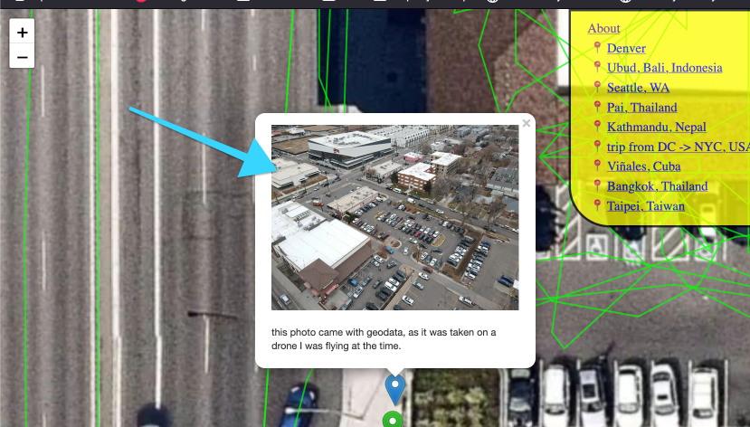
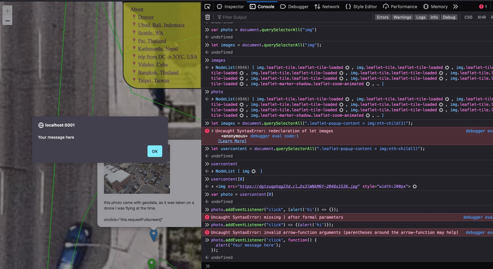

How to setup/run/use locally:

# Get token to use in `download_activities.py`


1. install everything
2. Run `download_activities.py` with `python download_activities.py`
3. Get login/creds with `uvicorn authenticate:app --reload` (more just below)
3. run `$python extra_runs.py` // get polyline for each activity
4. run webserver with `flask run`

## 2024-01-11

I keep doing bits and bobs of work on this, and being pleased with the results, but not really writing down any of the work, so here it is, best I can remember it.

I now have a functioning URL-parsing website. This works:

https://joshs-mobility-data-54dab943ebba.herokuapp.com/?zoom=15&latlng=18.785264,%2098.992305#

Look that the query perams:

`zoom=15 latong=18.785264, 2098.992305`. So that lets me quickly snag any view I want.

that took getting query params, passing them through to the rendered HTML as a variable (easier to do in Python/Flask than in Rails) and then... lets see, something like:

IF there is a latlong param set, load the map to that view initially...

... after all the other JS has happened, if there is a zoom param given, set the current zoom level to that.

I cleaned up/debugged some broken Polylines that was causing some issues/persistent browser console warnings/errors.

I futzed with a CSS rule to disable some other warning:

per https://github.com/Leaflet/Leaflet/issues/4686\#issuecomment-476738312

added colored start/end markers, the clusters are interesting to me. Would be cool to show directionality of the line. Color it from a spectrum, beginning to end? animate it to wiggle or glow in a pattern that gives it movement in a certain direction?

I've done a bunch of other cool css stuff. Peep the file for more.

### Today's big discovery: somewhere it IS possible to get photo lat/long in/out of strava

What I wanna do now, and am super excited about, is to maybe add photo overlays on the map. 

I would love love love to be able to add photos to activities, and have it fetchable via the API

What I wanna do is explore the API response, in something that feels like a Ruby script or Rails console session:

https://www.strava.com/activities/10381720567

I'd long ago given up hope that this was possible. I'd imagined the feature as a once-was, but maybe no longer available.

Here's the Strava user forum threads I found:

https://communityhub.strava.com/t5/strava-features-chat/photos-no-longer-display-on-map-possible-to-adjust-settings/m-p/1984#M438

(strava, I'm still having issues, and I think the photo URLs + latlng information IS NOT AVAILABLE VIA THE API!!!!!! I would gladly sign on as a contractor to finesse this feature into existance, and then wrap up my employment at Strava)

Here's what I can see in the web UI:


BTW, here's the photo I want to render to this map. Cool photo, huh?

https://dgtzuqphqg23d.cloudfront.net/QThlg8qH8Ci0kjAhbDXUOW0LAD1z_TTbvDs3lWNkM6Y-2048x1536.jpg

It's got two photos, from my DRONE, I wonder if it matters. The drone includes geolocation data, I thought I'd told my phont to include all available photo geolocation in the files....

So next, since I can confirm a RECENT activity, with attached photos, that are rendered to a map, I wanna do two things:

1. with a given URL, render my own photo/pin equivalent to the map (already almost done)
2. with a given activity, somehow find an attached photo? I'm going to re-explore via a Ruby REPL-type thing, the strava-ruby gem: https://github.com/dblock/strava-ruby-client

Next, here's what I've got for my pop-up now:

The blue one is clickable:


This is what happens on click:



I'd like it to open up into a full-screen photo on click, and i'm gonna see if I can make the marker load with the pop-up already opened...

OK, here's something that sorta works, I just added the final `openPopup()` call:

```javascript
 var photoMarker = L.marker([39.728373, -104.940488], {
      draggable: true,
      title: "i'm a title! This is where this photo was taken",
      style: "background-color:black;"
    }).addTo(map);
    photoMarker.bindPopup('<p>this photo came with geodata, as it was taken on a drone I was flying at the time.</p> onclick="this.requestFullscreen()"').openPopup();
```

gonna maybe write raw HTML that simply makes the image a clickable link, click to go straight to the img source?

```javascript
let images = document.querySelectorAll("img");
.leaflet-popup-content > img:nth-child(1)

addEventListener("click", (event) => {});

img.addEventListener("click", (alert('hi')) => {});

onclick="this.requestFullscreen()"

```

Good progress:



I'm leaning into this being heavy iteration:

```javascript
let thumb = document.querySelectorAll(".leaflet-popup-content > img:nth-child(1)")[0];
thumb.addEventListener('click', function() {
  this.requestFullscreen();
});
```

copy-paste friendly. Used the `ctrl-opt-i` element selector to click the image, find it in the html, right click the line of html, `copy css selector`, used that in the `document.querySelectorAll` to get the right img. when I was `querySelectorAll('img')`, I got thousands of results. the map seems to use a lot of img tags.

Anyway, making progress. I think `requestFullscreen` isn't exactly the right method but close. Now that I have this easily copy-pastable, I can reload the page, clear the clobbering mess of event listeners I added all over that bit of the DOM...

`onclick="window.open(this.src, '_blank');"`, I think. 

Heck yeah, that works. 

- https://stackoverflow.com/questions/67815853/how-do-i-make-an-image-full-screen-on-click#comment135891074_74505101
- https://www.kirupa.com/html5/finding_elements_dom_using_querySelector.htm
- https://stackoverflow.com/questions/2226953/how-to-attach-onclick-event-for-a-javascript-generated-textbox
- https://www.w3schools.com/jsref/event_onclick.asp

Lets work this back into the application...


## 2024-01-03

If you're forgetful, and don't remember why the strava code is returning `invalid`:

https://www.markhneedham.com/blog/2020/12/15/strava-authorization-error-missing-read-permission/

## 2022-02-28

I'm basically building https://metroview.strava.com/map/demo for myself! 

## 2021-12-05

## Getting creds for `extra_runs.py`

run `uvicorn authenticate:app --reload`

Visit localhost:5000, take that code, and use it in a `POST` to `/oauth/token`, with `client_id`, `client_secret`, and `code`

Here's what to do:

### Get `code` param

1. In a BROWSER (not Postman, because you need to follow the redirects...) go to:
2. https://www.strava.com/oauth/authorize?client_id=63764&response_type=code&redirect_uri=http://localhost/exchange_token&approval_prompt=force&scope=activity:read_all
3. approve it (I have a google account, am signed into Strava, etc)
4. grab the `code` param from the redirect after approving

### Use `code` to get `access_token`

do a POST to Strava via Postman to get the access code:

```curl
POST https://www.strava.com/oauth/token?client_id=63764&client_secret=2e6c5168e3b97a9c0975e5377041b8a416b4fbf8&code=0a0f72c337dce3ad0f4efd2ff86928fdd471fff3&grant_type=authorization_code
```

### Use returned `access_token` in `extra_runs.py`

replace the variable, do `python extra_runs.py`

It's working! Huzzah for polylines. I've got a TON more data in Strava now, so this will be a cool map rendering.

https://www.markhneedham.com/blog/2020/12/15/strava-authorization-error-missing-read-permission/

# Goal

To render my nephew's currently-being-tracked bike route (via my GPS watch and my bike) on an OSM map layer so he can pan/drag/zoom/explore in a way very similar to google maps. 

## Most current goal:

Get all of my Strava run polylines, render them to a map.

### Get what little I currently have visible on Heroku

I want to duplicate the functionality visible in [https://www.markhneedham.com/blog/2017/04/29/leaflet-strava-polylines-osm/](https://www.markhneedham.com/blog/2017/04/29/leaflet-strava-polylines-osm/).

I'd like to know how to deploy it to Heroku, so it's publicly visible. I've deployed Rails apps before, not Flask/Python apps. (here's the working version on Heroku: https://josh-strava-heatmap.herokuapp.com/)

It's working locally, but not on Heroko:


### Translate the Python over to Ruby

```python
# app.py
from flask import Flask
from flask import render_template
import csv
import json

app = Flask(__name__)

@app.route('/')
def my_runs():
    runs = []
    with open("runs.csv", "r") as runs_file:
        reader = csv.DictReader(runs_file)

        for row in reader:
            runs.append(row["polyline"])

    return render_template("leaflet.html", runs = json.dumps(runs))

if __name__ == "__main__":
    app.run(port = 5001)
```

I need to bring this over to Sinatra and Ruby. Seems... doable, though not straight forward.

How about:

```ruby
# app.rb
require 'sinatra'

get '/' do
  @runs = []
  erb :index, locals: { runs: @runs }
end
```

Ended up with:

```ruby
get '/' do
  @runs = []
  File.read('index.html')
end
```

OK, now I need to get runs....

# Starting from scratch, Early April:


OK, copied-and-pasted. It's been a while since I've written Python, and I've never actually made a Flask app, so I'm hoping it all runs without some hidden, subtle dependency problem that's really obvious to experts but not me.

here's how this sounds in Ruby:

> Oh, you tried to `ruby file.rb` and got an obscure error? I know that means your $PATH is wrong, RVM. 

Ugh. 

I guess I need `pip`, installed.


I need an  API key from Strava.

[https://www.strava.com/settings/api](https://www.strava.com/settings/api)

Got it. I'll need to save it to my ENV to avoid accidentally committing it to Github:

```
> export STRAVA_TOKEN="12398q798798798uyfhjsdkan"
> echo $STRAVA_TOKEN
```

OK, update the value in `extra_runs.py`, getting close to being able to run it.

Now I'm getting:

```
> python extra_runs.py
Traceback (most recent call last):
  File "/Users/joshthompson/me/strava_run_polylines_osm/extra_runs.py", line 22, in <module>
    r = requests.get("https://www.strava.com/api/v3/activities/{0}?include_all_efforts=true".format(activity["id"]), headers = headers)
TypeError: string indices must be integers
```

Something's breaking in line 22. I bet there's an authorization error somewhere that's causing a bad datatype in the response, so the function is breaking as it tries to execute on an error message instead of a blob of JSON or whatever.

If it were ruby I'd stick a pry in it, but it's pry so I'm googling `pry breakpoint`. 

Turns out it's `breakpoint()`

add it right before the error, and:

```
> python extra_runs.py
> /Users/joshthompson/me/strava_run_polylines_osm/extra_runs.py(23)<module>()
-> r = requests.get("https://www.strava.com/api/v3/activities/{0}?include_all_efforts=true".format(activity["id"]), headers = headers)
(Pdb) activity
'message'
(Pdb) response
{'message': 'Authorization Error', 'errors': [{'resource': 'AccessToken', 'field': 'activity:read_permission', 'code': 'missing'}]}
(Pdb)
```

Ahh, reading the blog post more clearly, I can see part of what he's getting at. I copied-pasted a different (earlier) document in, I can see what he's working on.

## Strava API Basics

OK, I've never interacted w/the Strava API before. I was hoping it was as easy as getting a private key from Strava, saving it as an environment variable, and running the script, so I tried all that.

No dice. Getting a 401 from the strava API. I don't know python, and don't yet _fully_ understand API calls well enough to know just by reading this python code, I can debug it in Python, so I'm going to rebuild the request in Postman.

In postman, I'm going to try a simple `get` for:

```
https://www.strava.com/api/v3/athlete/activities
```

Ah, Authorization problems. Here's the response: 

```javascript
{
    "message": "Authorization Error",
    "errors": [
        {
            "resource": "Athlete",
            "field": "access_token",
            "code": "invalid"
        }
    ]
}
```

It's expecting me to authorize even what seems like it should be "public" data. Surely some of the Strava API is public to hit w/o authorization? Oh well.

I've been lucky enough to have some passing familiarity with what's going on here, because of some painful past experiences. 

Let's get authorized w/the Strava API.

I think we need to create an app w/in Strava.

I googled things like `authorize strava api` and `how to generate strava api key` and found a few sorta haphazard guides. It's still not screamingly clear what to do here. Maybe it is to you?

- [https://developers.strava.com/docs/authentication/](https://developers.strava.com/docs/authentication/)
- [https://yizeng.me/2017/01/11/get-a-strava-api-access-token-with-write-permission/](https://yizeng.me/2017/01/11/get-a-strava-api-access-token-with-write-permission/)
- [https://developers.strava.com/](https://developers.strava.com/)
- [https://developers.strava.com/playground/](https://developers.strava.com/playground/)

It seems like I need API keys, so I created an app, and tried making the public and private keys. Meh, I need to go get an access token from the Strava oAuth server (I suppose?)

Reading through https://yizeng.me/2017/01/11/get-a-strava-api-access-token-with-write-permission/

----------

## POSTing to strava.com/oauth/token

OK, here was my second API call attempt:


Third attempt, more closely reading the yizeng.me piece:


## Strava API 

---------------

Two weeks have elapsed since I wrote the above...

Onward. 

I need to authenticate against Strava. No idea how to do it in Python, so I'm firing up Postman and seeing if I can recreate this series of calls there.

Working through [this guide](https://developers.strava.com/docs/getting-started/#oauth)

### Step 1: `Go to https://www.strava.com/settings/api and copy your Client ID`

Easy. Mine is: `63764`

### Step 2: `Paste your Client ID into this URL: http://www.strava.com/oauth/authorize?client_id=[REPLACE_WITH_YOUR_CLIENT_ID]&response_type=code&redirect_uri=http://localhost/exchange_token&approval_prompt=force&scope=read`

OK, slightly reformatted:

Go to: [http://www.strava.com/oauth/authorize](http://www.strava.com/oauth/authorize) and include the following query params:

```
client_id=[REPLACE_WITH_YOUR_CLIENT_ID]
response_type=code
redirect_uri=http://localhost/exchange_token
approval_prompt=force
scope=read
```

This is... extremely not intuitive. Let's do it in Postman anyway:

Sigh, didn't work in postman, may have made a typo.

Sure enough, when I visit in the browser:

[https://www.strava.com/oauth/authorize?client_id=63764&response_type=code&redirect_uri=http://localhost/exchange_token&approval_prompt=force&scope=read](https://www.strava.com/oauth/authorize?client_id=63764&response_type=code&redirect_uri=http://localhost/exchange_token&approval_prompt=force&scope=read)

I get what's expected. 

### Step 5 or 6: `Make a cURL request to exchange the authorization code and scope for a refresh token, access token, and access token expiration date (step 7a from the graph). Replace the client_secret and code. `

They include a suggestion to use Postman, and I did. Success:


This is unreal.

Next, to use Swagger, have to auth their app to this odd "strava app" i have, so I got to `https://www.strava.com/settings/api` and set the `authorized callback domain` value to developers.strava.com

### Step 8: Pick rightly (but you have to figure it out) the scopes to authorize the swagger API

I wanted it to have all read access, so I checked too many boxes. Turns out you keep getting errors from the API if you have anything but the first box checked.

The errors are cryptic, took me 4 attempts. 


### Step 11: Find a taste of success with Swagger

Check it out! 

I finally authorized Swagger to my account, and:


I can see my athlete stats! I'm going to retry this python script now...

Feels like we might be getting close to it working.

Damnit. `response` still throws an authorization error.

I'll work towards the API call from this script in swagger

Here's the relevant code, to recap:

```python
token = os.environ["STRAVA_TOKEN"]
headers = {'Authorization': "Bearer {0}".format(token)}

with open("runs.csv", "w") as runs_file:
    writer = csv.writer(runs_file, delimiter=",")
    writer.writerow(["id", "polyline"])

    page = 1
    while True:
        r = requests.get("https://www.strava.com/api/v3/athlete/activities?page={0}".format(page), headers = headers)
        response = r.json()
```


AAAAAGH THIS IS SO NON-INTUITIVE!!!

I re-ran the script, but got the same error as before:

> {'message': 'Authorization Error', 'errors': [{'resource': 'AccessToken', 'field': 'activity:read_permission', 'code': 'missing'}]}

Not super helpful.

I tried re-exporting my `STRAVA_TOKEN` environment variable to different values gathered from `https://www.strava.com/settings/api`, but no dice.

Then remembered that I got this access token in the Postman `POST` request to `https://www.strava.com/oauth/token`

So, opened that up, checked the output, thought "yeah, lets try that":


This has been _shockingly_ difficult.

Anyway, how do I know this is the right value?

simply because I got a different error message. Behold, the obvious difference!


so, lets fix this. I'm going to rebuild it in Postman first.


Finally, it seems like the response tells us the problem. The `api` seems to want a parameter/key-value pair submitted 

### Step 27, reauthorize Strava app, update `scope`, get "privileged" token:

[https://www.strava.com/oauth/authorize?client_id=63764&response_type=code&redirect_uri=http://localhost/exchange_token&approval_prompt=force&scope=read_all](https://www.strava.com/oauth/authorize?client_id=63764&response_type=code&redirect_uri=http://localhost/exchange_token&approval_prompt=force&scope=read_all)

See that last query param, `scope=read_all`? I'm trying that. It was `read` before.

Big difference. ¯\\\_(ツ)_/¯ 

Ugh. No dice.

## Step 56, pull your hair out, pivot

Reading [https://markhneedham.com/blog/2020/12/20/strava-export-all-activities-json/](https://markhneedham.com/blog/2020/12/20/strava-export-all-activities-json/)

Maybe I can make this work, and learn the minimum Strava API stuff I need for the rest.

```
pip install stravalib fastapi uvicorn jsonlines
export CLIENT_ID="63764"
export CLIENT_SECRET="client_secret"
```

Copy/paste what he recommends into `authenticate.py` and per his instructions, in my terminal I run:

```
uvicorn authenticate:app --reload
```

And we've got a web server running.

Feels like the Sinatra of Python.

Following his instructions, note that you'll have to `mkdir data && touch data/activites-all.json` for the script to run.

Kept running into errors, realized the file open mode wasn't `open or create` it was just `open`. 

Great success! I've got data!

back to `extra_runs.py` - I bet I can just read in the JSON file I just created...

## References

- [Leaflet: Mapping Strava runs/polylines on Open Street Map](https://markhneedham.com/blog/2017/04/29/leaflet-strava-polylines-osm/)
- [Above author's gist w/the code (python, flask, leaflet)](https://gist.github.com/mneedham/34b923beb7fd72f8fe6ee433c2b27d73)
- [module not found error](https://stackoverflow.com/questions/44913898/modulenotfounderror-no-module-named-requests)
- [https://www.reddit.com/r/learnpython/comments/g135yz/strava_api_code_missing/](https://www.reddit.com/r/learnpython/comments/g135yz/strava_api_code_missing/)


## TILs

```p
> python extra_runs.py
# ugh, missing module. how do you install modules in python?
# what's python's version of RBENV. Pip. OK. Oh, I have pip, guess
# I don't know how to use it.
> python -m pip --version
> pip install requests
$ python -m pip install requests

environment til
```

- how to run basic python app on heroku?

```
pip install gunicorn
pip freeze > requirements.txt
```

https://medium.com/the-andela-way/deploying-a-python-flask-app-to-heroku-41250bda27d0


```
https://devcenter.heroku.com/articles/buildpacks
```
https://dashboard.heroku.com/apps/b0a05afc-05aa-4d23-973b-0d664a39ecfc/activity/builds/1e866a44-9dcc-4825-a016-8d0f715b286b
https://devcenter.heroku.com/articles/buildpacks#setting-a-buildpack-on-an-application

