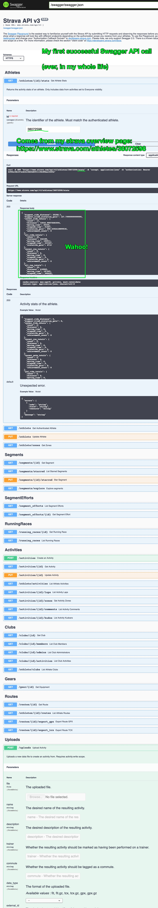

# Goal

To render my nephew's currently-being-tracked bike route (via my GPS watch and my bike) on an OSM map layer so he can pan/drag/zoom/explore in a way very similar to google maps. 

## Most current goal:

I want to duplicate the functionality visible in [https://www.markhneedham.com/blog/2017/04/29/leaflet-strava-polylines-osm/](https://www.markhneedham.com/blog/2017/04/29/leaflet-strava-polylines-osm/).

I'd like to know how to deploy it to Heroku, so it's publically visible. I've deployed Rails apps before, not Flask/Python apps.

Decided to make it a Sinatra app: [https://vast-meadow-00701.herokuapp.com/](https://vast-meadow-00701.herokuapp.com/)


# Starting from scratch, Early April:


OK, copied-and-pasted. It's been a while since I've written Python, and I've never actually made a Flask app, so I'm hoping it all runs without some hidden, subtle dependency problem that's really obvious to experts but not me.

here's how this sounds in Ruby:

> Oh, you tried to `ruby file.rb` and got an obscure error? I know that means your $PATH is wrong, RVM. 

Ugh. 

I guess I need `pip`, installed.


I need an  API key from Strava.

[https://www.strava.com/settings/api](https://www.strava.com/settings/api)

Got it. I'll need to save it to my ENV to avoid accidentally committing it to Github:

```
> export STRAVA_TOKEN="12398q798798798uyfhjsdkan"
> echo $STRAVA_TOKEN
```

OK, update the value in `extra_runs.py`, getting close to being able to run it.

Now I'm getting:

```
> python extra_runs.py
Traceback (most recent call last):
  File "/Users/joshthompson/me/strava_run_polylines_osm/extra_runs.py", line 22, in <module>
    r = requests.get("https://www.strava.com/api/v3/activities/{0}?include_all_efforts=true".format(activity["id"]), headers = headers)
TypeError: string indices must be integers
```

Something's breaking in line 22. I bet there's an authorization error somewhere that's causing a bad datatype in the response, so the function is breaking as it tries to execute on an error message instead of a blob of JSON or whatever.

If it were ruby I'd stick a pry in it, but it's pry so I'm googling `pry breakpoint`. 

Turns out it's `breakpoint()`

add it right before the error, and:

```
> python extra_runs.py
> /Users/joshthompson/me/strava_run_polylines_osm/extra_runs.py(23)<module>()
-> r = requests.get("https://www.strava.com/api/v3/activities/{0}?include_all_efforts=true".format(activity["id"]), headers = headers)
(Pdb) activity
'message'
(Pdb) response
{'message': 'Authorization Error', 'errors': [{'resource': 'AccessToken', 'field': 'activity:read_permission', 'code': 'missing'}]}
(Pdb)
```

Ahh, reading the blog post more clearly, I can see part of what he's getting at. I copied-pasted a different (earlier) document in, I can see what he's working on.

## Strava API Basics

OK, I've never interacted w/the Strava API before. I was hoping it was as easy as getting a private key from Strava, saving it as an environment variable, and running the script, so I tried all that.

No dice. Getting a 401 from the strava API. I don't know python, and don't yet _fully_ understand API calls well enough to know just by reading this python code, I can debug it in Python, so I'm going to rebuild the request in Postman.

In postman, I'm going to try a simple `get` for:

```
https://www.strava.com/api/v3/athlete/activities
```

Ah, Authorization problems. Here's the response: 

```javascript
{
    "message": "Authorization Error",
    "errors": [
        {
            "resource": "Athlete",
            "field": "access_token",
            "code": "invalid"
        }
    ]
}
```

It's expecting me to authorize even what seems like it should be "public" data. Surely some of the Strava API is public to hit w/o authorization? Oh well.

I've been lucky enough to have some passing familiarity with what's going on here, because of some painful past experiences. 

Let's get authorized w/the Strava API.

I think we need to create an app w/in Strava.

I googled things like `authorize strava api` and `how to generate strava api key` and found a few sorta haphazard guides. It's still not screamingly clear what to do here. Maybe it is to you?

- [https://developers.strava.com/docs/authentication/](https://developers.strava.com/docs/authentication/)
- [https://yizeng.me/2017/01/11/get-a-strava-api-access-token-with-write-permission/](https://yizeng.me/2017/01/11/get-a-strava-api-access-token-with-write-permission/)
- [https://developers.strava.com/](https://developers.strava.com/)
- [https://developers.strava.com/playground/](https://developers.strava.com/playground/)

It seems like I need API keys, so I created an app, and tried making the public and private keys. Meh, I need to go get an access token from the Strava oAuth server (I suppose?)

Reading through https://yizeng.me/2017/01/11/get-a-strava-api-access-token-with-write-permission/

----------

## POSTing to strava.com/oauth/token

OK, here was my second API call attempt:


Third attempt, more closely reading the yizeng.me piece:


## Strava API 

---------------

Two weeks have elapsed since I wrote the above...

Onward. 

I need to authenticate against Strava. No idea how to do it in Python, so I'm firing up Postman and seeing if I can recreate this series of calls there.

Working through [this guide](https://developers.strava.com/docs/getting-started/#oauth)

### Step 1: `Go to https://www.strava.com/settings/api and copy your Client ID`

Easy. Mine is: `63764`

### Step 2: `Paste your Client ID into this URL: http://www.strava.com/oauth/authorize?client_id=[REPLACE_WITH_YOUR_CLIENT_ID]&response_type=code&redirect_uri=http://localhost/exchange_token&approval_prompt=force&scope=read`

OK, slightly reformatted:

Go to: [http://www.strava.com/oauth/authorize](http://www.strava.com/oauth/authorize) and include the following query params:

```
client_id=[REPLACE_WITH_YOUR_CLIENT_ID]
response_type=code
redirect_uri=http://localhost/exchange_token
approval_prompt=force
scope=read
```

This is... extremely not intuitive. Let's do it in Postman anyway:

Sigh, didn't work in postman, may have made a typo.

Sure enough, when I visit in the browser:

[https://www.strava.com/oauth/authorize?client_id=63764&response_type=code&redirect_uri=http://localhost/exchange_token&approval_prompt=force&scope=read](https://www.strava.com/oauth/authorize?client_id=63764&response_type=code&redirect_uri=http://localhost/exchange_token&approval_prompt=force&scope=read)

I get what's expected. 

### Step 5 or 6: `Make a cURL request to exchange the authorization code and scope for a refresh token, access token, and access token expiration date (step 7a from the graph). Replace the client_secret and code. `

They include a suggestion to use Postman, and I did. Success:


This is unreal.

Next, to use Swagger, have to auth their app to this odd "strava app" i have, so I got to `https://www.strava.com/settings/api` and set the `authorized callback domain` value to developers.strava.com

### Step 8: Pick rightly (but you have to figure it out) the scopes to authorize the swagger API

I wanted it to have all read access, so I checked too many boxes. Turns out you keep getting errors from the API if you have anything but the first box checked.

The errors are cryptic, took me 4 attempts. 


### Step 11: Find a taste of success with Swagger

Check it out! 

I finally authorized Swagger to my account, and:



I can see my athlete stats! I'm going to retry this python script now...

Feels like we might be getting close to it working.

Damnit. `response` still throws an authorization error.

I'll work towards the API call from this script in swagger

Here's the relevant code, to recap:

```python
token = os.environ["STRAVA_TOKEN"]
headers = {'Authorization': "Bearer {0}".format(token)}

with open("runs.csv", "w") as runs_file:
    writer = csv.writer(runs_file, delimiter=",")
    writer.writerow(["id", "polyline"])

    page = 1
    while True:
        r = requests.get("https://www.strava.com/api/v3/athlete/activities?page={0}".format(page), headers = headers)
        response = r.json()
```


AAAAAGH THIS IS SO NON-INTUITIVE!!!

I re-ran the script, but got the same error as before:

> {'message': 'Authorization Error', 'errors': [{'resource': 'AccessToken', 'field': 'activity:read_permission', 'code': 'missing'}]}

Not super helpful.

I tried re-exporting my `STRAVA_TOKEN` environment variable to different values gathered from `https://www.strava.com/settings/api`, but no dice.

Then remembered that I got this access token in the Postman `POST` request to `https://www.strava.com/oauth/token`

So, opened that up, checked the output, thought "yeah, lets try that":


This has been _shockingly_ difficult.

Anyway, how do I know this is the right value?

simply because I got a different error message. Behold, the obvious difference!


so, lets fix this. I'm going to rebuild it in Postman first.


Finally, it seems like the response tells us the problem. The `api` seems to want a parameter/key-value pair submitted 

### Step 27, reauthorize Strava app, update `scope`, get "privileged" token:

[https://www.strava.com/oauth/authorize?client_id=63764&response_type=code&redirect_uri=http://localhost/exchange_token&approval_prompt=force&scope=read_all](https://www.strava.com/oauth/authorize?client_id=63764&response_type=code&redirect_uri=http://localhost/exchange_token&approval_prompt=force&scope=read_all)

See that last query param, `scope=read_all`? I'm trying that. It was `read` before.

Big difference. ¯\\\_(ツ)_/¯ 

Ugh. No dice.

## Step 56, pull your hair out, pivot

Reading [https://markhneedham.com/blog/2020/12/20/strava-export-all-activities-json/](https://markhneedham.com/blog/2020/12/20/strava-export-all-activities-json/)

Maybe I can make this work, and learn the minimum Strava API stuff I need for the rest.

```
pip install stravalib fastapi uvicorn jsonlines
export CLIENT_ID="63764"
export CLIENT_SECRET="client_secret"
```

Copy/paste what he recommends into `authenticate.py` and per his instructions, in my terminal I run:

```
uvicorn authenticate:app --reload
```

And we've got a web server running.

Feels like the Sinatra of Python.

Following his instructions, note that you'll have to `mkdir data && touch data/activites-all.json` for the script to run.

Kept running into errors, realized the file open mode wasn't `open or create` it was just `open`. 

Great success! I've got data!

back to `extra_runs.py` - I bet I can just read in the JSON file I just created...

## References

- [Leaflet: Mapping Strava runs/polylines on Open Street Map](https://markhneedham.com/blog/2017/04/29/leaflet-strava-polylines-osm/)
- [Above author's gist w/the code (python, flask, leaflet)](https://gist.github.com/mneedham/34b923beb7fd72f8fe6ee433c2b27d73)
- [module not found error](https://stackoverflow.com/questions/44913898/modulenotfounderror-no-module-named-requests)
- [https://www.reddit.com/r/learnpython/comments/g135yz/strava_api_code_missing/](https://www.reddit.com/r/learnpython/comments/g135yz/strava_api_code_missing/)


## TILs

```p
> python extra_runs.py
# ugh, missing module. how do you install modules in python?
# what's python's version of RBENV. Pip. OK. Oh, I have pip, guess
# I don't know how to use it.
> python -m pip --version
> pip install requests
$ python -m pip install requests

environment til
```

- how to run basic python app on heroku?

```
pip install gunicorn
pip freeze > requirements.txt
```

https://medium.com/the-andela-way/deploying-a-python-flask-app-to-heroku-41250bda27d0


```
https://devcenter.heroku.com/articles/buildpacks
```
https://dashboard.heroku.com/apps/b0a05afc-05aa-4d23-973b-0d664a39ecfc/activity/builds/1e866a44-9dcc-4825-a016-8d0f715b286b
https://devcenter.heroku.com/articles/buildpacks#setting-a-buildpack-on-an-application

